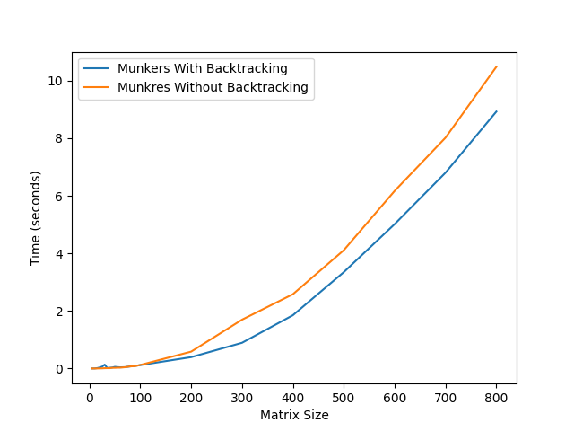
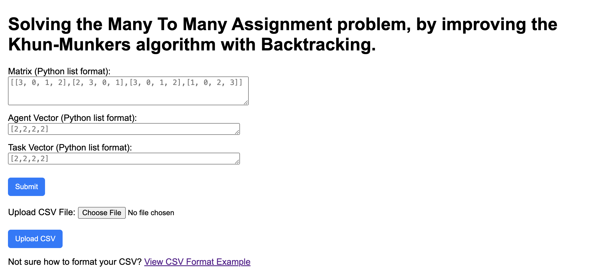
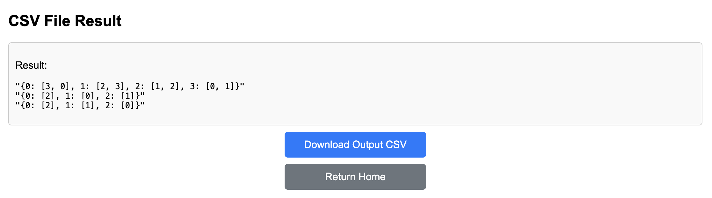

# Many to Many Assignment Problem

## Authors: Tom Shabalin and Dor Harizi

## About
An implementation of the algorithm in: `"Solving the Many to Many assignment problem by improving the Kuhn–Munkres algorithm with backtracking"`.

The Hungarian method is a combinatorial optimization algorithm that solves the assignment problem in polynomial time and which anticipated later primal–dual methods.

The main issue with the Hungarian method, is that he can only assign one agnet to one task. In real-life scenario, usually it's not the case.

Each agent, can be assign to a couple of tasks (for example a software engineer can do 2-5 tasks at the same time).

The authors of the paper: `Solving the Many to Many assignment problem by improving the Kuhn–Munkres algorithm with backtracking` (https://www.sciencedirect.com/science/article/pii/S0304397516000037?ref=pdf_download&fr=RR-2&rr=89b6294adc86e3e7), imroved the Hungarian method by using Backtracking and allowing for each agent to be assigned to more then 1 task at a time, and for each task to be assgined to more than 1 agent at a time.

After the implementation, and after hardcore testing with large random values, we decided to create a simple website using FLASK that will give the user the oportunity of using this algorithm on a different inputs.

## The main GOAL
The main goal of this algorithm is to find the miminum cost assignment for the agents and tasks, while allowing for each agent to be assigned for more then 1 task at a time, and for each task to be assigned for more then 1 agent at a time.

## Input
1. `Matrix (M)`: where $M[i,j]$ is the cost of assigning agent $i$ to task $j$.
2. `Ability Agent Vector`: where $vector[i]$ is how many tasks can agent $i$ take.
3. `Vector of the Tasks range`: where $vector[i]$ is to how many agents, task $i$ can be assigned to.

## Output
A dictionary containing the final assignments, where the keys are the agents and the values are the tasks.

## Example

`Input:`

$M = [[3, 0, 1, 2],[2, 3, 0, 1],[3, 0, 1, 2],[1, 0, 2, 3]]$\
$vector_{agents} = [2,2,2,2]$\
$vector_{tasks} = [2,2,2,2]$

`Output:`

${0: [3, 0], 1: [2, 3], 2: [1, 2], 3: [0, 1]}$

The first agent is assigned to the fourth and the first tasks.\
The second agent is assigned to the third and fourth tasks.\
The third agent is assigned to the second and third tasks.\
And the fourth agent is assigned to the first and second tasks.

## Time comparison to original Hungarian method implementation
In order to validate ourselves, we compared our results and the running time to the already implemented original Khun-Munkers algorithm (which you can find here: https://github.com/bmc/munkres).

As can be seen, on a large inputs sizes, it takes for us much less time to compute the final assignments.

## About the website
### First option
In our website, you can test the algorithm by yourself.\
You can provide a manually entered input, by typing the matirx, agents vector and the task vector. After clicking on `Submit`, you will be taken to the result page where the result will be displayed.

### Second Option
You can upload a predefined `CSV` file, with more then 1 input (we added a link to exmaple csv file so you will not get lost).\
After uploading the csv file, you will be redirected to another page where the result will be shown and also you could download the result as `CSV` file to your own PC.

For any questions, you can contact me directly via my email:\
tomshabalin95@gmail.com